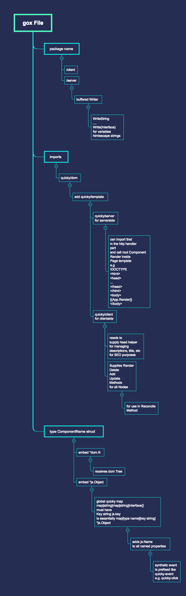

# quicky
Go Webcomponent Framework

## Introduction
### Goals
quicky is meant to be a template parser for server and client side rendering. It handles these two use cases by code generation.

The server side templates will render down to functions that acquire a write buffer with utility functions to embed variables of types bool and string into an output stream.

This framework will be written in Go and the front side code is transpiled by gopherjs. It has also joy as transpiler engine in mind. But given the very early stage of joy it will be written in gopherjs trying to keep the features needed in order to run slim. This is meant to increase its portability to joy.

### Datatypes
There will be only two dataypes permissible to interface with the quicky templates.

- string
- bool

The only exception being data delivered to subcomponents which can be an interface or struct type in case of single components and map[int]struct/interface for keyed components in a loop and []struct/interface for non keyed components.

### Limitations and Architectural Decisions
#### Non Reactive
quicky isn't meant to be a reactive framework. It will traverse the DOM holding references to DOM Nodes. Every expression can only either 

- set a DOM attribute
- modify its value
- hide/show a DOM Node and its chilren
- create a sub component by providing data and referencing a template file
#### Fixed HTML Structure
A DOM Nodes type is fixed. A **div** can never become a **p** Node or any other DOM Node.
#### Editor Support
Quicky templates are stored in .gox files with Syntax Mode set to Go. You can freely switch between Go and XML mode for focusing either on templating or template logic.

**Anatomy of a .gox File**

