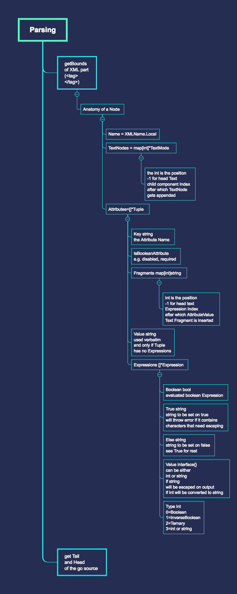

# Parsing
## Data Types

The Component embeds three struct pointers

- *dom.N
- *js.Object
- *dom.C

## *dom.N

This is the representation of a Virtual DOM Node

**Source**
```
//N is a VDOM Node
type N struct {
	//N is the XMLName.Local os the Tag
	N string
	//A is an array of pointers to Attribute Nodes,
	//T stands for Tuple
	A []*T
	//C is an array of pointers to Child Nodes
	C []*N
	//P is a pointer to the Parent Node or nil 
	//if this the Components Root Node
	P *N
	//TN is a map of Text Nodes
	// map key int is the position
	//-1 for head Text Nodes 
	//or the index of the Child Node after which this Text Node is rendered
	TN map[int]*TN
	//I is a counter to tell which TextNode will be the next to get rendered
	I int
}
```


## Illustration

